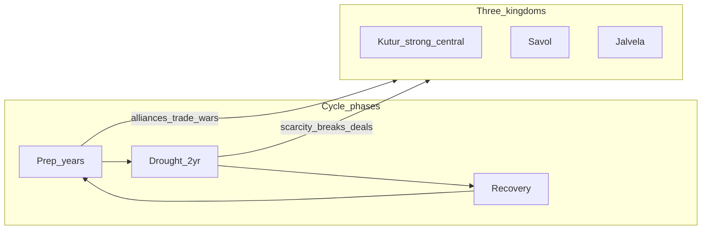

# Politics of three kingdoms under a recurring megadrought

## Core constraint

If everyone **knows** drought is coming, politics is not “surprise famine” but **clock-driven strategy**: stockpile, trade, raid, ally, and break treaties on a schedule. A **2-year** event is long enough to exhaust reserves, break supply lines, and force ugly choices; it is short enough that rulers who survive it plan for the **next** cycle.

*(Your [notes/story/story.md](notes/story/story.md) uses a **20-year** cycle; you asked **10-year**. Shorter cycle = elites live through more crises in a career, less time to forget last time’s betrayals, slightly more institutional memory and cynicism.)*

## Faction scale: is three kingdoms enough for intrigue?

**Yes, three is enough** if you treat each crown as a *policy* hub, not the only actor inside it. Real intrigue comes from **competing goals inside the same flag**: who controls a granary city, a well field, or a pass matters as much as “Kutur vs Savol.”

- **Three-way geometry** already gives you: two-vs-one, preemptive betrayal, peace treaties nobody trusts, and drought timing that forces simultaneous gambits.
- **Adding more kingdoms** is optional, not required. Each new sovereign state should earn its place with a **distinct resource or chokepoint**; otherwise you get a crowded map and thinner characterization. Four or five can work if one is a **buffer**, **trade city-state**, or **religious seat** with clear leverage—not “another generic kingdom.”
- **Vassals / marcher lords / great houses (recommended)** increase intrigue **without** exploding the top-level political brand:
  - They can **delay levies**, **sell grain across borders**, **open gates** (literally or diplomatically), or **switch liege** when the drought starves their people and the crown cannot help.
  - Kutur’s “midland” is especially fertile for this: occupied or resentful regions are classic **fifth-column** spaces; Savol and Jalvela can court them secretly.
  - **Allegiance shifts** read best when **bounded**: fealty to a crown vs survival of a valley—not every lord becoming a free agent every session, or nothing feels stable enough to plan against.

**Practical default for your setup:** keep **Kutur, Savol, Jalvela** as the three names players remember; add **2–4 named sub-realms** total across the map (not necessarily evenly split) with **water, grain, or gate** hooks. Expand only when a new polity has a job in the drought cycle.

## Why kingdoms exist; why three; how they might differ

### Why “kingdoms” at all (in-world excuses you can mix)

- **Scale of survival:** drought logistics need **tax, corvée, and grain law** at scale; a patchwork of clans can’t build inter-year cisterns or move armies to a pass without a liege who can punish defectors.
- **Post-catastrophe states:** after a prior megadrought or invasion, people accept **hard crowns** because “the granary king” literally kept ancestors alive.
- **Hydraulic legitimacy:** rule is tied to **maintaining ditches, wells, and quotas**; usurpers win by capturing water registers, not just thrones.
- **Military residue:** the old empire’s **three field armies** never reunified; each general’s descendants became a dynasty (institutional memory = campaign flashbacks).

### Why three—not one, two, or five

| Count  | What you gain / lose                                                                                                                                                         |
| ------ | ---------------------------------------------------------------------------------------------------------------------------------------------------------------------------- |
| **1**  | Clear chain of command; **weak neighbor intrigue** unless you treat provinces as quasi-kingdoms (vassals become mandatory for politics).                                     |
| **2**  | Simple rivalry; **fewer “who betrays whom” permutations**; alliances are mostly temporary ceasefires, less geometry.                                                         |
| **3**  | **Smallest stable “unstable triangle”**: two-vs-one, rotating betrayals, “ally of the week” without needing a spreadsheet. Matches your Kutur vs Savol/Jalvela beat cleanly. |
| **5+** | Rich diplomacy but **higher cognitive load**; risk of “another kingdom syndrome” unless each has a sharp drought job (see faction-scale section).                            |

**Narrative justification for “exactly three”** (pick one or layer them):

1. **Geography tripartite** — Three major **basins** or **corridors** (highland snowmelt / midland breadbasket / coast or marsh), each able to feed a separate fiscal-military machine; no fourth basin large enough to sustain a peer state (or the fourth is wasteland, dead zone, or monster border).
2. **Treaty of partition** — After an unwinnable war, mediators **froze** three crowns so no single victor could starve the others (ironically locking in permanent competition).
3. **Succession explosion** — One royal house split into **three recognized lines** with relics, archives, or temple backing; reunification is heresy or treason in each telling.
4. **Hydraulic dependency** — **Upstream / midstream / downstream** (or headwaters / plain / outlet): politically they *must* bargain as peers in the dry years even when one is militarily stronger—until someone seizes the headwaters and breaks the math (your Kutur campaign arc).

### Ways the three kingdoms can feel different (orthogonal axes—assign freely)

Use **one primary + one secondary** per kingdom so they stay legible.

**Geography and drought role**

- **Headwater power** — Controls snowmelt and dams; strong in prep years, hated downstream.
- **Granary plain** — Feeds armies in good years; **target** in drought (everyone wants their silos).
- **Coast / mist / trade** — Weaker farmland but **salt, fish, ports, foreign grain**; can survive if seas stay open.
- **Highland / forest** — Less wheat, more **wood, ore, goats**; raiding culture or mobile logistics.

**Regime type (how decisions get made)**

- **Centralized empire** (fits **Kutur** in your notes) — Fast mobilization; brittle if provinces hate the capital.
- **Confederation of lords** — Hard to betray *collectively*; easy for **one** border earl to flip.
- **Temple or law-heavy crown** — Legitimacy from **ritual calendars** (when to release water, when war is blasphemy); crises when omens and granaries disagree.

**Drought doctrine (what “virtue” means in public)**

- **Hoarders** — Granaries, laws against export; seen as cruel or responsible depending on who’s hungry.
- **Raiders** — “We take our rain from the neighbor’s fields”; honorable in one saga, criminal in another.
- **Traders** — Buy survival; vulnerable to blockade and price spikes.
- **Migrators** — Seasonal population shifts; border friction and ethnic tension as **policy**.

**Identity hooks (cheap color, deep if you want)**

- Different **funeral/water taboos** (who may touch a well, who inherits a spring).
- Different **war ritual** (your “sporting” war fits one kingdom as national pastime, another as sacred duty).
- **Script, archive, census** — Who maps water rights; literacy as power.

**Example sketch aligned to your triangle (optional, not binding)**

- **Kutur:** midland + imperial machine + hoard/extract from conquered breadbasket; doctrine “order and quotas.”
- **Savol:** highland or mixed; confederation or proud nobility; doctrine “we don’t beg—we bargain or raid.”
- **Jalvela:** coast/trade or secondary river valley; traders or temple calendar; doctrine “the sea / the treaty / the oaths”—until drought makes oaths expensive.

## What each kingdom “wants” (structural, not personality)

- **Survive the two years** without losing the capital or army.
- **Control buffers**: river heads, wells, aquifers, mountain snowmelt, coastal fog traps, cisterns, granaries, caravan routes—whatever your map allows.
- **Export hunger** outward if possible: tribute in grain/water, displacement of pressure onto neighbors, or timed offensives so *their* harvest fails while yours is guarded.

## Typical political postures (three-way geometry)

1. **Hegemon + two weaker (matches your Kutur vs Savol/Jalvela sketch)**
  - **Kutur** treats drought prep as **imperial logistics**: forced grain levies, controlled waterworks, garrisons on chokepoints. Its politics: army vs tax base vs occupied midland.  
  - **Savol and Jalvela** oscillate between **marriage of convenience** (coordinate to not starve) and **knife in the back** (sell the ally for Kutur’s terms or a surprise grab of a shared river).  
  - **Drought timing** encourages Kutur to **strike or tighten screws just before** the dry years—when rivals are stockpiling and vulnerable—unless Kutur’s own heartland is also drought-hit (your “Kutur’s grasp weakens” beat).
2. **Treaty layer that always strains**
  - **Water-sharing compacts** with explicit quotas; **grain corridors**; hostage exchanges or royal marriages timed to the cycle.  
  - Every cycle, someone argues the treaty was signed “under different rainfall” or after a war boundary shifted.
3. **Internal politics dominate outward policy**
  - Noble houses with **regional water rights** can flip the crown’s strategy.  
  - Cities riot when granaries are emptied for the army; rulers start **wars to justify emergency rule** or to seize someone else’s stores.  
  - **Migration**: border provinces empty toward capitals or across borders—becomes casus belli (“you harbored our rebels / you poisoned the well”).
4. **“Sporting” war (your tone)**
  Even ritualized conflict becomes **scheduled**: limited campaigns in *prep* years to seize a reservoir or punish defection, with norms about not burning the aqueduct—but norms fail in year two of drought when stomachs growl.

## Petty vs true reasons (how it plays at the table)

- **True drivers**: snowmelt control, underground water, grain surplus in the non-drought years, salt/metal if trade collapses, army payroll, preventing civil war.  
- **Petty sparks**: a diverted irrigation ditch, a marriage snub, a “accidental” dam, a prophet’s deadline (you already have oracle / 30-days pressure—excellent lever to force **simultaneous** bad decisions in all three realms).

## Campaign-useful political “moves”

| Phase       | Kutur                                         | Savol / Jalvela (together or apart)                        |
| ----------- | --------------------------------------------- | ---------------------------------------------------------- |
| Mid-cycle   | Consolidate midland, tax granaries, recruit   | Smuggle grain, secret canal deals, assassinate negotiators |
| Pre-drought | Timed offensive or embargo                    | Race to fortify headwaters; try to align against Kutur     |
| Drought Y1  | Extraction from subjects, border seizures     | Betrayal window: who gets cut off first                    |
| Drought Y2  | Desperation offensives or crackdown           | Refugee floods, splinter factions, foreign mercenaries     |
| Recovery    | Reparations, “peace” treaties, marriage pacts | Resentment seeds next cycle’s war                          |

## Optional doc pass (only if you want it in the repo)

If you want this captured for the game: add a short subsection under **Sources of conflict** or a new file under [notes/story/](notes/story/) (e.g. `politics-drought-cycle.md`) and a one-line pointer in [notes/structure.md](notes/structure.md). No code changes.